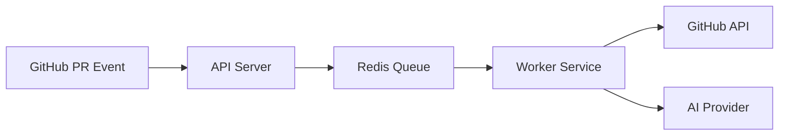

# PR Review System 🤖

> **Production-grade backend system for automated GitHub Pull Request reviews using AI**

This repository implements a **scalable, event-driven backend architecture** that listens to GitHub Pull Request events, processes them asynchronously, and posts AI-generated review feedback directly on the PR.

---

## 🚀 What This Project Does

* Listens to GitHub `pull_request` webhooks
* Queues PR review jobs using Redis (BullMQ)
* Processes jobs using scalable background workers
* Uses AI (Gemini) to analyze code changes
* Posts structured review comments back to GitHub

Designed with **real-world backend engineering principles**:

* Asynchronous processing
* Horizontal scalability
* Failure isolation
* Clean separation of concerns

---

## 🧠 Architecture Overview

The system follows a **queue-based, event-driven architecture**:



For a full breakdown, see:
👉 [`docs/architecture.md`](docs/architecture.md)

---

## 📚 Documentation

All detailed documentation lives inside the `docs/` folder.

### Start Here

* 📄 **System Overview** → [`docs/overview.md`](docs/overview.md)
* 🏗️ **Architecture & Flow Charts** → [`docs/architecture.md`](docs/architecture.md)

### Setup & Contribution

* ⚙️ **Setup (Node.js + Docker + Gemini)** → [`docs/setup.md`](docs/setup.md)
* 🤝 **Contribution Guidelines** → [`docs/contribution.md`](docs/contribution.md)

---

## 🛠️ Tech Stack

* **Runtime:** Node.js (ESM)
* **Queue:** BullMQ + Redis (Upstash / Local)
* **Workers:** Node.js background workers
* **AI:** Google Gemini API
* **Infra:** Docker, Docker Compose
* **Platform:** GitHub Apps & Webhooks

---

## 🧪 Local Quick Start

```bash
npm install
npm run dev
node dist/worker/worker.js
```

For full setup instructions:
👉 [`docs/setup.md`](docs/setup.md)

---

## 🎯 Project Goals

* Demonstrate real-world backend architecture
* Serve as a reference for queue-based systems
* Be interview- and production-ready

This project prioritizes **clarity, reliability, and scalability** over shortcuts.

---

## 🤝 Contributing

Contributions are welcome!

Before opening a PR, please read:
👉 [`docs/contribution.md`](docs/contribution.md)

---

## 📄 License

MIT License

---


