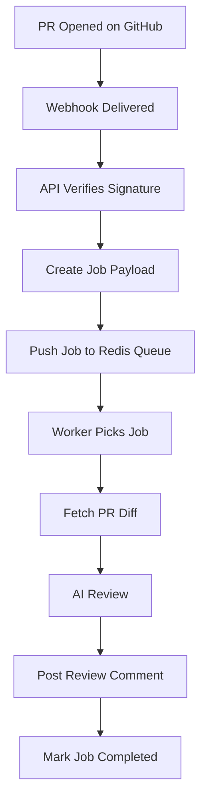

# System Architecture

This document describes the **high-level architecture, core building blocks, and end-to-end flow** of the PR Review System. It is intended to give a complete mental model of how the backend works before diving into implementation details.

---

## 1. Architectural Overview

The PR Review System follows a **distributed, event-driven architecture** built around asynchronous job processing.

### Key Characteristics

* Event-driven via GitHub webhooks
* Queue-based workload isolation
* Stateless API layer
* Horizontally scalable workers
* External integrations (GitHub + AI)

---

## 2. High-Level System Diagram

```mermaid
graph LR
    GH[GitHub Repository]
    WH[GitHub Webhook]
    API[Backend API Server]
    Q[Redis Queue<br/>(BullMQ / Upstash)]
    W[Worker Service]
    GHAPI[GitHub REST API]
    AI[AI Provider]

    GH --> WH
    WH --> API
    API -->|Enqueue Job| Q
    Q -->|Consume Job| W
    W -->|Fetch PR / Post Review| GHAPI
    W -->|Analyze Code| AI
```

---

## 3. Component Responsibilities

### 3.1 GitHub App & Webhooks

* Emits `pull_request` events
* Sends signed webhook payloads
* Acts as the external event source

---

### 3.2 Backend API Server

The API server is the **ingestion layer** of the system.

**Responsibilities**

* Verify webhook signatures
* Validate payload structure
* Extract repository & PR metadata
* Generate GitHub installation tokens
* Create and enqueue jobs

**Non-Responsibilities**

* No PR diff processing
* No AI calls
* No blocking operations

---

### 3.3 Queue Layer (Redis + BullMQ)

The queue is the **decoupling and buffering layer** between request ingestion and processing.

**Why a Queue?**

* Absorbs webhook bursts
* Prevents API overload
* Enables retries and backoff
* Supports horizontal worker scaling

**Queue States**

* `wait`
* `active`
* `completed`
* `failed`

---

### 3.4 Worker Service

Workers are **background processors** responsible for heavy computation and external calls.

**Responsibilities**

* Fetch PR metadata and diffs
* Normalize and chunk code changes
* Send data to AI model
* Parse AI response
* Post review comments to GitHub

**Characteristics**

* Stateless
* Configurable concurrency
* Independently deployable

---

### 3.5 External Services

* **GitHub REST API** – PR data, diffs, comments
* **AI Provider** – Code analysis and feedback generation

---

## 4. End-to-End Flow Chart



---

## 5. Job Metadata & Identity

Each job represents **one PR review request**.

**Typical Job Payload**

* `owner`
* `repo`
* `prNumber`
* `installationId`

**Job Identity**

* Deterministic `jobId`
* Enables deduplication
* Ensures idempotent processing

---

## 6. Scalability Model

### API Layer

* Stateless
* Scales horizontally behind a load balancer

### Worker Layer

* Scale based on queue depth
* Multiple worker instances supported
* Parallel processing via concurrency

### Queue Layer

* Managed Redis (Upstash)
* Central coordination point

---

## 7. Failure Boundaries

The system is designed with **clear failure isolation**:

* API failure does not affect workers
* Worker crash does not drop jobs
* External API failures trigger retries

Failed jobs are retained for inspection and replay.

---

## 8. Architectural Principles

* **Separation of Concerns** – API vs Worker
* **Asynchronous by Default** – No blocking paths
* **Scalable Units** – Independent scaling
* **Production-Oriented** – Retries, idempotency, observability

---

## 9. Summary

This architecture mirrors **real-world production systems** used for webhook processing, background jobs, and AI-powered workflows. It provides:

* Clear system boundaries
* Predictable scaling behavior
* Strong fault tolerance

This document serves as the **foundation** for all other technical documentation in the `docs/` folder.

---

**Author:** Adarsh
