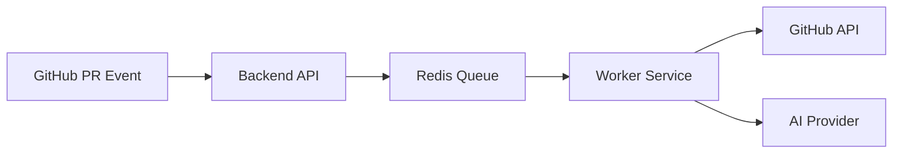

# System Overview

This document provides a **high-level overview** of the PR Review System. It explains *what the system does*, *why it exists*, and *how the major pieces fit together*, without going deep into internal implementation details.

This file is intended for:

* New contributors
* Reviewers and interviewers
* Quick system understanding before reading deeper docs

---

## 1. What Is This System?

The PR Review System is an **automated backend service** that reviews GitHub Pull Requests using AI.

When a Pull Request is opened or updated:

* GitHub sends a webhook event
* The system asynchronously reviews the code
* AI-generated feedback is posted directly on the PR

The entire process is designed to be **fast, scalable, and reliable**, even under high webhook traffic.

---

## 2. Core Problem Being Solved

GitHub webhooks can:

* Arrive in bursts
* Contain large payloads
* Trigger expensive downstream work (diff parsing, AI calls)

Doing all of this synchronously would:

* Slow down webhook responses
* Cause timeouts
* Make the system fragile

### Solution

Use a **queue-based, event-driven architecture** that separates:

* *Event ingestion* (fast)
* *Heavy processing* (async, scalable)

---

## 3. High-Level System Flow

**Summary:**

* API receives events
* Queue buffers work
* Workers process jobs independently

---

## 4. Key Building Blocks

### Backend API

* Entry point for GitHub webhooks
* Stateless and lightweight
* Responsible only for validation and job creation

### Queue (Redis + BullMQ)

* Central coordination layer
* Buffers jobs
* Enables retries and backpressure

### Worker Service

* Performs PR analysis
* Communicates with GitHub and AI provider
* Scales independently from API

---

## 5. Design Principles

The system is built around the following principles:

* **Asynchronous by default** – no blocking webhook paths
* **Separation of concerns** – API ≠ Worker
* **Horizontal scalability** – scale by adding instances
* **Failure isolation** – one component failing does not crash others

---

## 6. What This System Is NOT

* Not a monolithic backend
* Not a synchronous request–response pipeline
* Not tightly coupled to a single AI provider

This makes the system easier to scale, debug, and evolve.

---

## 7. How This Fits Into the Docs

Recommended reading order:

1. `overview.md` ← *You are here*
2. `architecture.md` – system structure & flow charts
3. `components.md` – deep dive into each service
4. `deployment.md` – infra & Docker setup

---

## 8. Summary

The PR Review System is a **production-oriented backend architecture** designed to handle real-world webhook traffic and expensive AI workloads safely.

This overview establishes the mental model needed to understand the deeper technical documents that follow.

---

**Author:** Adarsh
